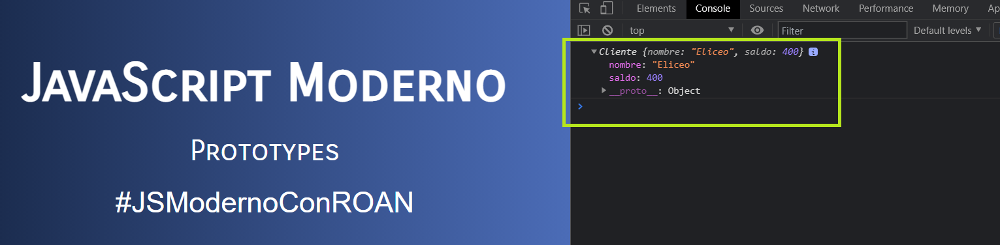

# Proyecto 009-POO.
Js es un **lenguaje** orientado a objetos **basado en prototipos**, en lugar de estar basado en clases como tal. Js es un **lenguaje interpretado** por el navegador por lo que no se necesita compilarse como otros lenguajes. Js en un **lenguaje dinámico sin tipado** quiere decir que no se especifica el tipo de dato . Se realizó el Proyecto 009-POO.  🏆
  

